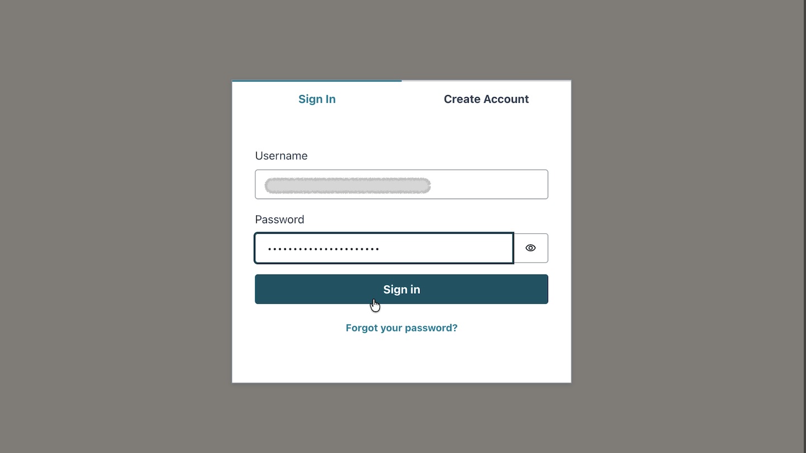
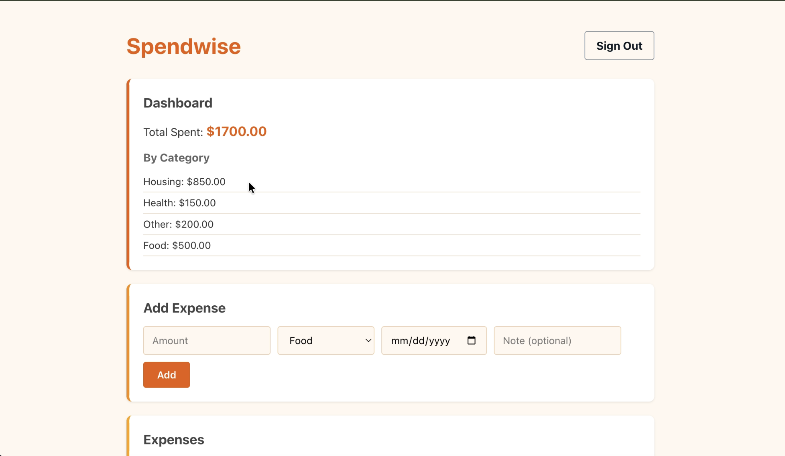
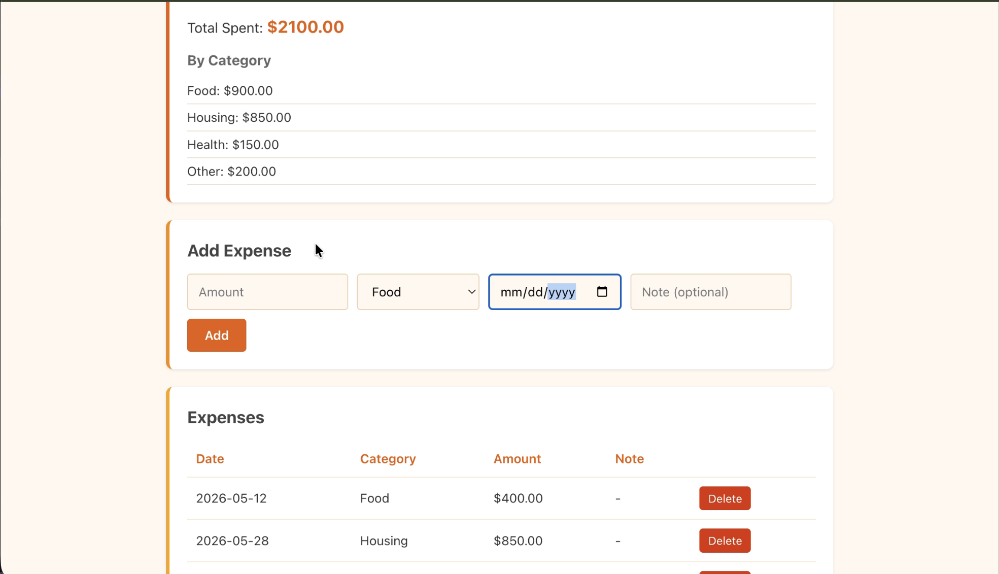
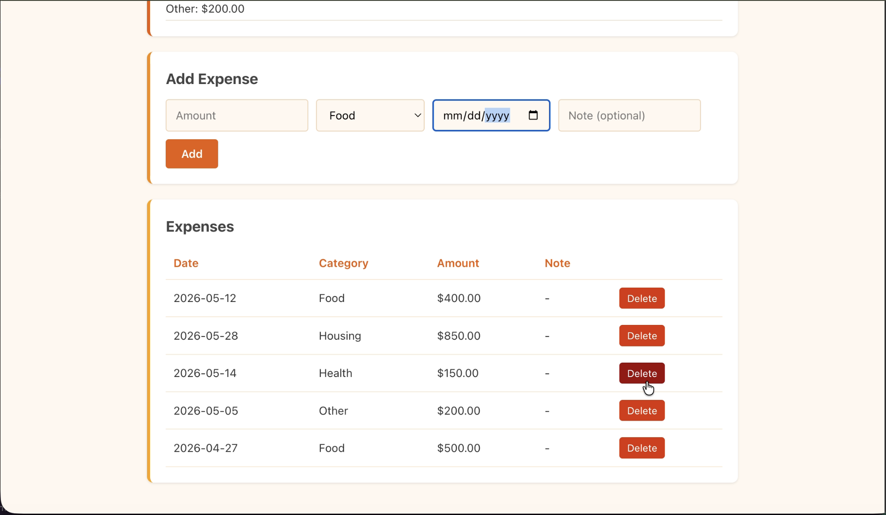

# Spendwise

A serverless personal budget tracker built on AWS.

## Why This Project
I wanted to build something real. Not follow a tutorial, not complete a lab with predefined steps actually sit down with a blank repo and figure it out.

Serverless was the area I wanted to understand deeply. I had studied the individual services but had never connected them together into something that actually worked. I wanted to know what happens when a request leaves a browser and travels through CloudFront, gets checked by Cognito, hits API Gateway, triggers a Lambda function, and lands in DynamoDB. The only way to really understand that is to build it.

A budget tracker was the right scope small enough to finish, real enough to matter. I made every decision myself: which services to use, how to structure the backend, how to handle auth, how to define infrastructure as code. When things broke and they did. I had to figure out why.

## Stack
- **Frontend**: React → S3 + CloudFront
- **Backend**: Python Lambda + API Gateway
- **Database**: DynamoDB
- **Auth**: Cognito
- **Infrastructure**: AWS SAM
- **CI/CD**: GitHub Actions

## Architecture


## Features
- Add expenses by category, date, and amount
- Dashboard with total spent and category breakdown
- Delete expenses
- Secure login via Cognito

## Screenshots
## Screenshots





## What I Learned
- **AWS SAM**: defines the entire backend Lambda functions, DynamoDB table, API Gateway routes, and IAM roles.
- **CORS errors**: are browser security enforcement, not frontend bugs. The fix always lives on the API side.
- **DynamoDB**: returns numeric values as strings in some SDK versions. Always cast with `parseFloat()` before doing math.
- **Cognito app clients**: for browser-based apps must be public with no client secret client secrets are for server-side apps only.
- **GitHub Actions**: secrets keep AWS credentials out of code while still enabling automated deployments.


### Note 
The AWS backend was decommissioned after development to manage cloud credit usage. The full infrastructure can be redeployed in minutes using `sam deploy`  the pipeline and IaC are fully intact.


Clone the repo and install frontend dependencies:

```bash
git clone https://github.com/s-dad/SpendWise.git
cd SpendWise/frontend
npm install
npm start
```

To deploy the full backend you will need your own AWS account:

```bash
cd infrastructure/spendwise-backend
sam build
sam deploy --guided
```

Update `src/api.js` with your API Gateway URL from the CloudFormation Outputs, and create a Cognito user pool following the setup in the [docs](docs/) folder.


## License
MIT


