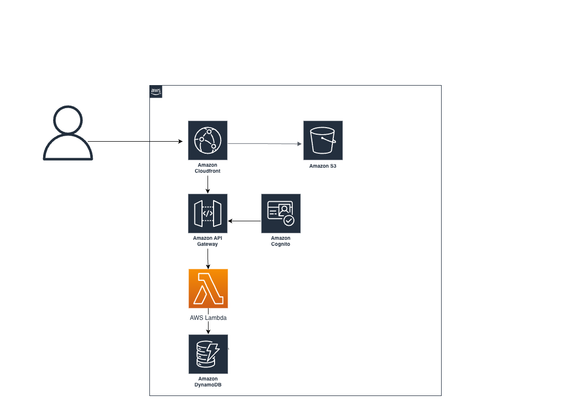

# Spendwise

A serverless personal budget tracker built on AWS.

## Stack
- **Frontend**: React → S3 + CloudFront
- **Backend**: Python Lambda + API Gateway
- **Database**: DynamoDB
- **Auth**: Cognito
- **Infrastructure**: AWS SAM
- **CI/CD**: GitHub Actions

## Architecture

## Features
- Add expenses by category, date, and amount
- Dashboard with total spent and category breakdown
- Delete expenses
- Secure login via Cognito